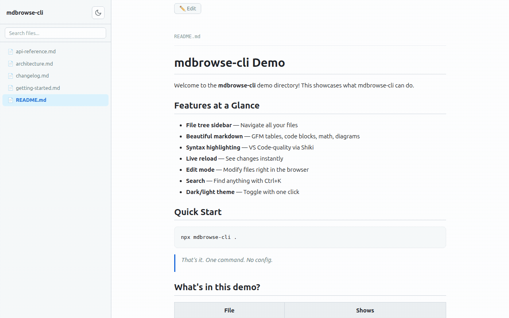
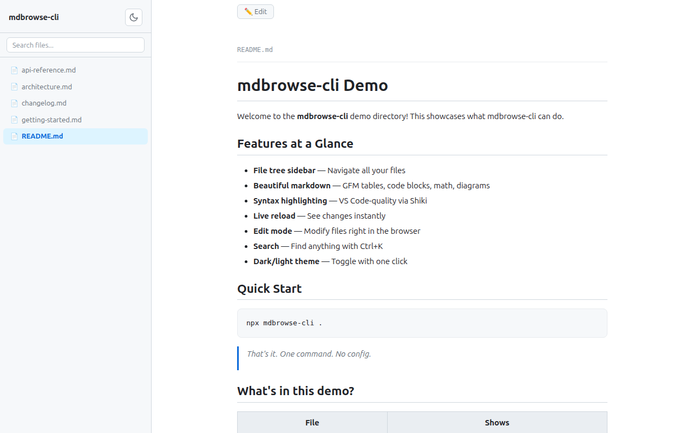
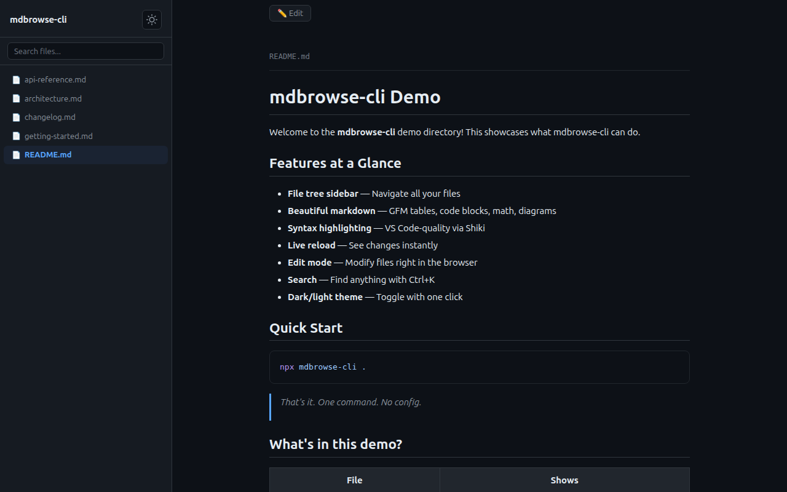
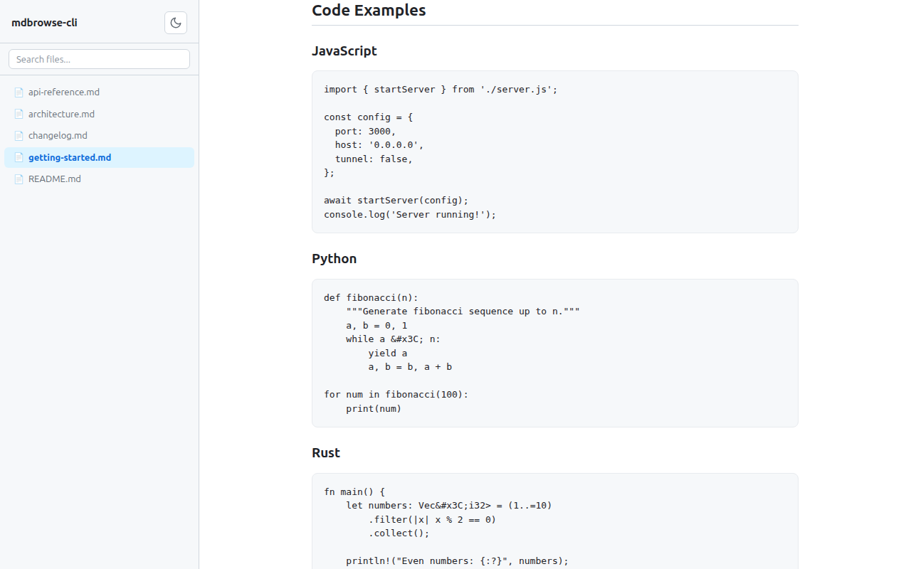
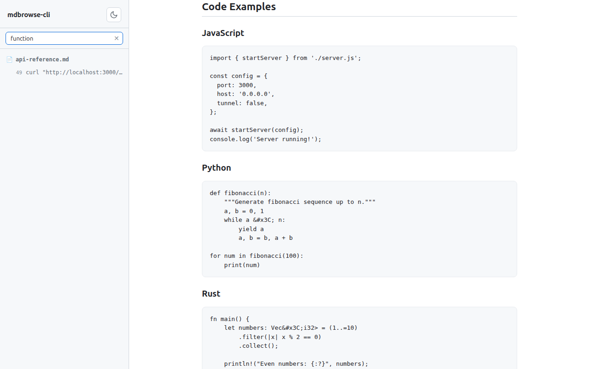
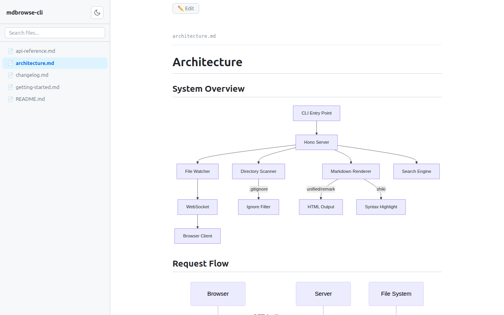
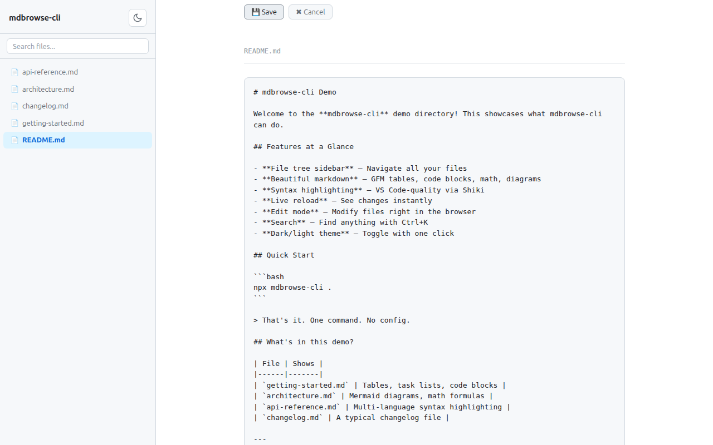

# mdbrowse

**Browse and preview markdown files in any directory.**

[](https://www.npmjs.com/package/mdbrowse-cli)
[](LICENSE)

Zero-install CLI that spins up a local web UI with a file tree, rendered markdown, live reload, and optional Cloudflare Tunnel for remote access.



## Quick start

```bash
npx mdbrowse-cli .           # serve current directory
npx mdbrowse-cli ./docs      # serve a specific folder
npx mdbrowse-cli . --tunnel  # expose via Cloudflare Tunnel
```

Opens in your browser automatically. On SSH/headless servers, grab the printed URL.

## Features

<table>
<tr>
<td width="50%">

**File tree + markdown rendering**

Browse files in the sidebar, view beautifully rendered markdown with GFM tables, task lists, and more.



</td>
<td width="50%">

**Dark / light theme**

Auto-detects system preference. Toggle with one click.



</td>
</tr>
<tr>
<td width="50%">

**Syntax highlighting**

VS Code-quality code blocks via Shiki — JavaScript, Python, Rust, and 100+ languages.



</td>
<td width="50%">

**Search**

Filename + content search with Ctrl+K. Results highlighted in context.



</td>
</tr>
<tr>
<td width="50%">

**Mermaid diagrams + math**

Flowcharts, sequence diagrams, and LaTeX math rendered inline.



</td>
<td width="50%">

**Edit mode**

Toggle to edit any file, Ctrl+S to save, with tab indentation support.



</td>
</tr>
</table>

**Full feature list:**

- 📁 **File tree sidebar** — browse all files in the directory
- 📝 **Markdown rendering** — GFM tables, task lists, strikethrough, and more
- 🎨 **Syntax highlighting** — VS Code-quality code blocks via Shiki
- 🔢 **Math & diagrams** — LaTeX math (KaTeX) and Mermaid diagrams
- 📋 **Frontmatter** — YAML frontmatter displayed as a clean table
- 🔴 **Live reload** — auto-refreshes when files change on disk
- ✏️ **Edit mode** — toggle to edit, Ctrl+S to save, tab indentation
- 🔍 **Search** — filename + content search, Ctrl+K to open
- 🌗 **Dark / light theme** — auto-detects system preference, with toggle
- 🌐 **Cloudflare Tunnel** — instant public URL with `--tunnel`
- 🔒 **Basic auth** — protect access with `--auth user:pass`
- 🚫 **Read-only mode** — disable editing with `--read-only`

## CLI flags

| Flag | Default | Description |
|------|---------|-------------|
| `[directory]` | `.` | Directory to serve |
| `-p, --port <number>` | `3000` | Port to listen on |
| `--host <address>` | `0.0.0.0` | Host to bind to |
| `--tunnel` | off | Expose via Cloudflare Tunnel (requires `cloudflared`) |
| `--auth <user:pass>` | off | Require basic HTTP authentication |
| `--read-only` | off | Disable file editing |
| `--no-ignore` | off | Show all files (don't respect `.gitignore`) |

If the port is in use, mdbrowse-cli automatically tries the next available port.

## Configuration

mdbrowse-cli supports a config file and environment variables so you don't have to pass flags every time.

**Priority chain:** `CLI args > Environment variables > .mdbrowse.json > Built-in defaults`

### Config file (`.mdbrowse.json`)

Place a `.mdbrowse.json` in the directory you're serving:

```json
{
  "port": 4000,
  "host": "0.0.0.0",
  "tunnel": false,
  "auth": "admin:secret",
  "readOnly": true,
  "noIgnore": false
}
```

### Environment variables

| Variable | Maps to | Example |
|----------|---------|---------|
| `MDBROWSE_PORT` | `--port` | `MDBROWSE_PORT=8080` |
| `MDBROWSE_HOST` | `--host` | `MDBROWSE_HOST=localhost` |
| `MDBROWSE_TUNNEL` | `--tunnel` | `MDBROWSE_TUNNEL=1` |
| `MDBROWSE_AUTH` | `--auth` | `MDBROWSE_AUTH=admin:secret` |
| `MDBROWSE_READ_ONLY` | `--read-only` | `MDBROWSE_READ_ONLY=1` |
| `MDBROWSE_NO_IGNORE` | `--no-ignore` | `MDBROWSE_NO_IGNORE=1` |

See [docs/configuration.md](docs/configuration.md) for full details, examples, and shell profile setup.

## Use cases

**Remote / headless servers** — Working on a cloud dev box or VPS? Run `npx mdbrowse-cli . --tunnel` to get a public URL and view rendered markdown from any browser.

**AI coding tools** — Using Claude Code, Codex, or similar tools that generate lots of markdown? Browse their output rendered, not raw.

**Documentation browsing** — Point it at your `docs/` folder for a quick local docs site with search, live reload, and edit support.

## Try the demo

```bash
git clone https://github.com/saleehk/mdbrowse.git
cd mdbrowse && npm install
npx mdbrowse-cli docs/
```

## Tech stack

[Hono](https://hono.dev/) server, [unified](https://unifiedjs.com/)/remark markdown pipeline, [Shiki](https://shiki.style/) syntax highlighting, [KaTeX](https://katex.org/) math, [Mermaid](https://mermaid.js.org/) diagrams, [chokidar](https://github.com/paulmillr/chokidar) file watching, vanilla JS frontend — no build step.

## License

[MIT](LICENSE)
