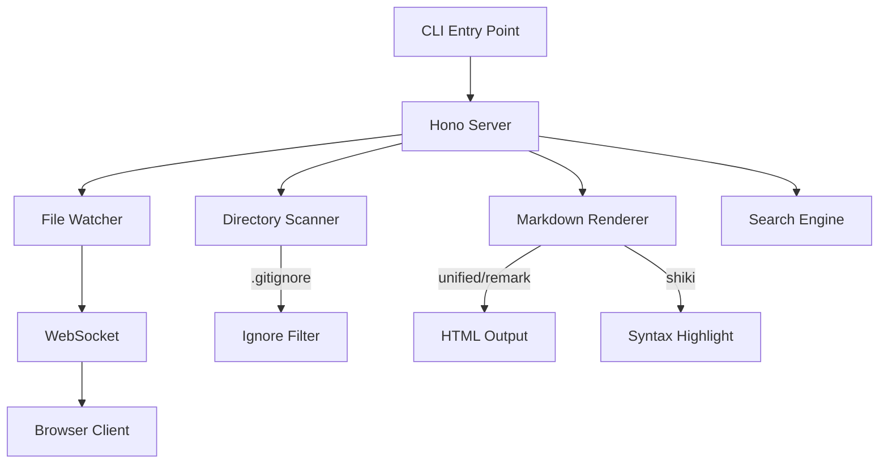
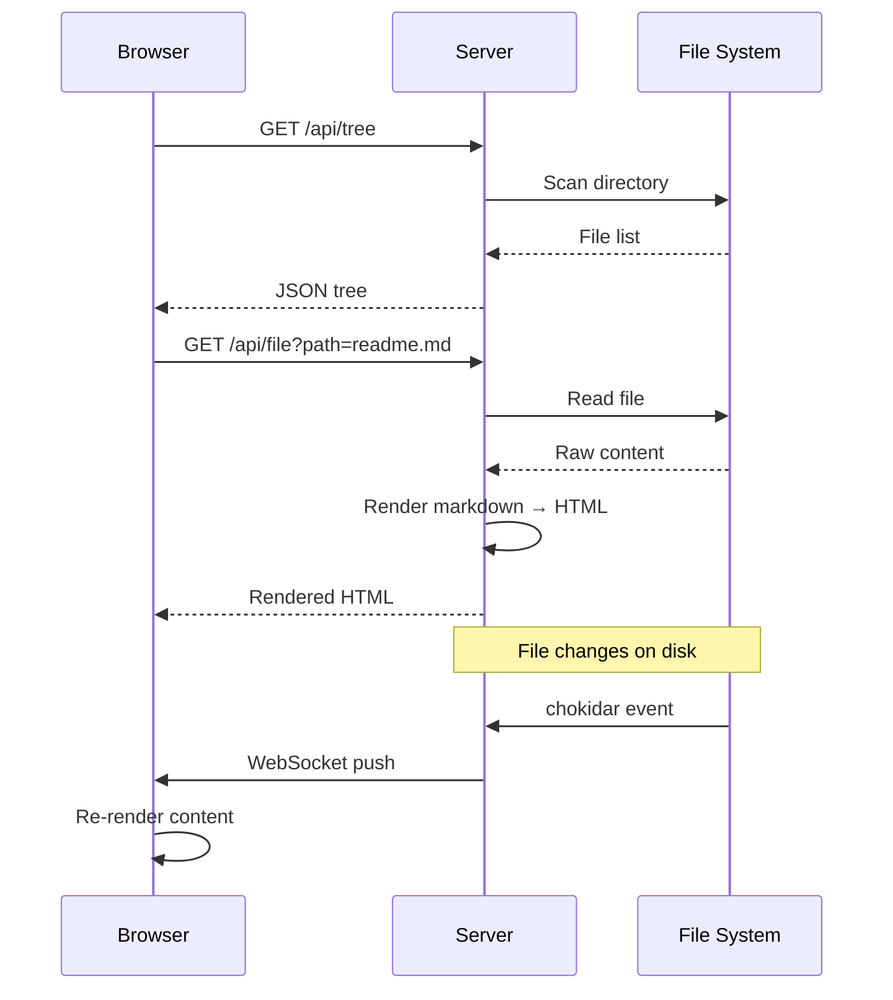

# Architecture

## System Overview

## Request Flow

## Math Support

Inline math: $E = mc^2$

The quadratic formula:

$$x = \frac{-b \pm \sqrt{b^2 - 4ac}}{2a}$$

Euler's identity:

$$e^{i\pi} + 1 = 0$$

Maxwell's equations in differential form:

$$\nabla \cdot \mathbf{E} = \frac{\rho}{\epsilon_0}$$

$$\nabla \times \mathbf{B} = \mu_0 \mathbf{J} + \mu_0 \epsilon_0 \frac{\partial \mathbf{E}}{\partial t}$$
