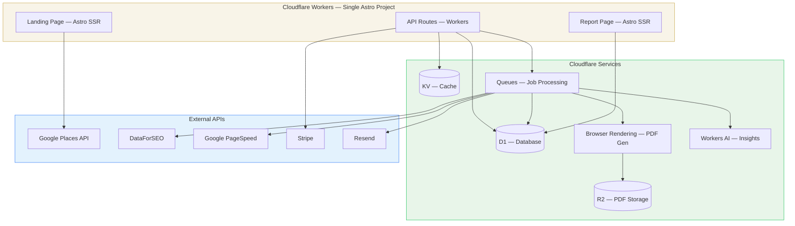
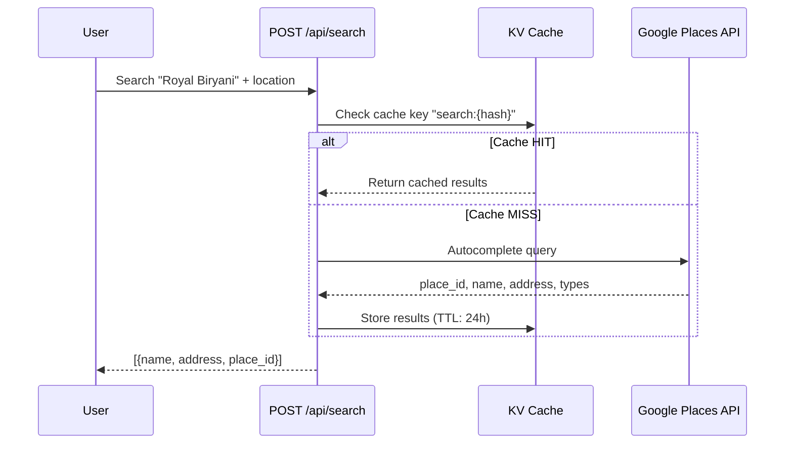
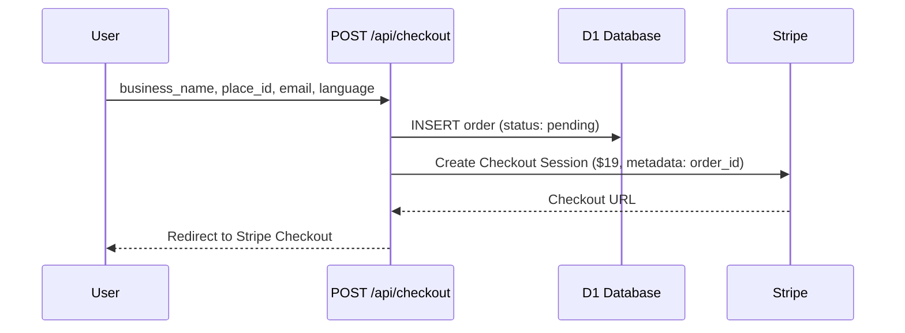
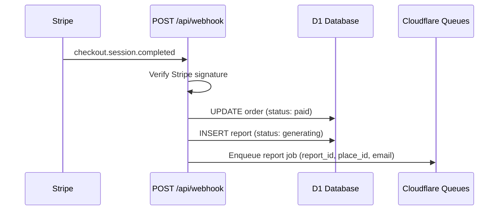
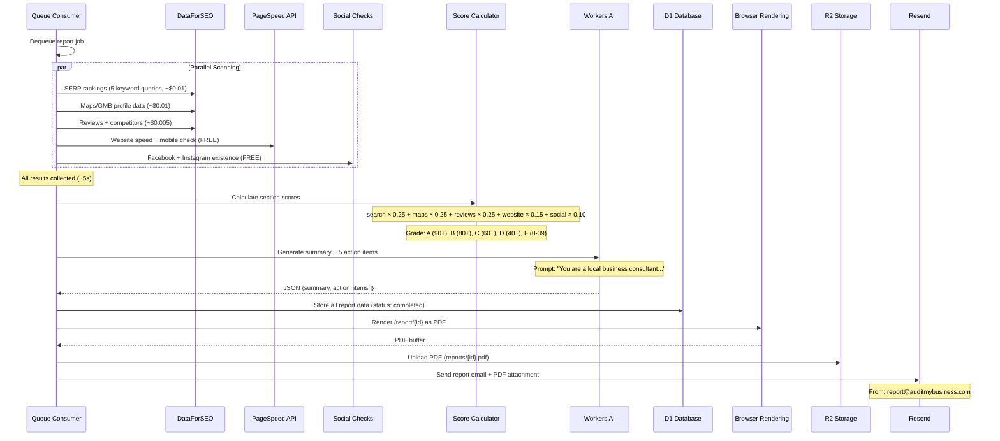
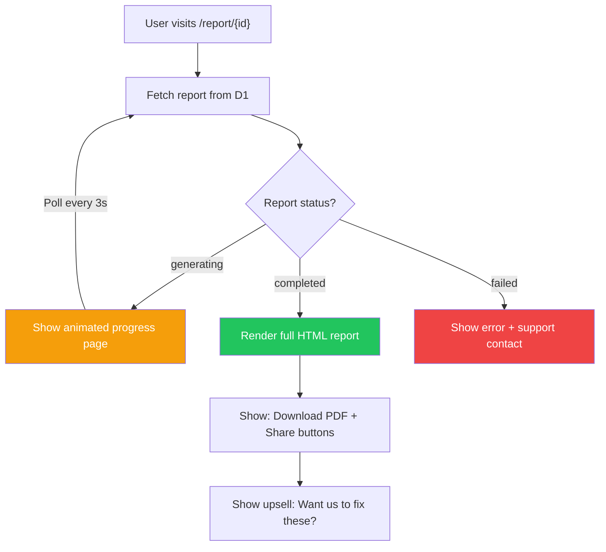
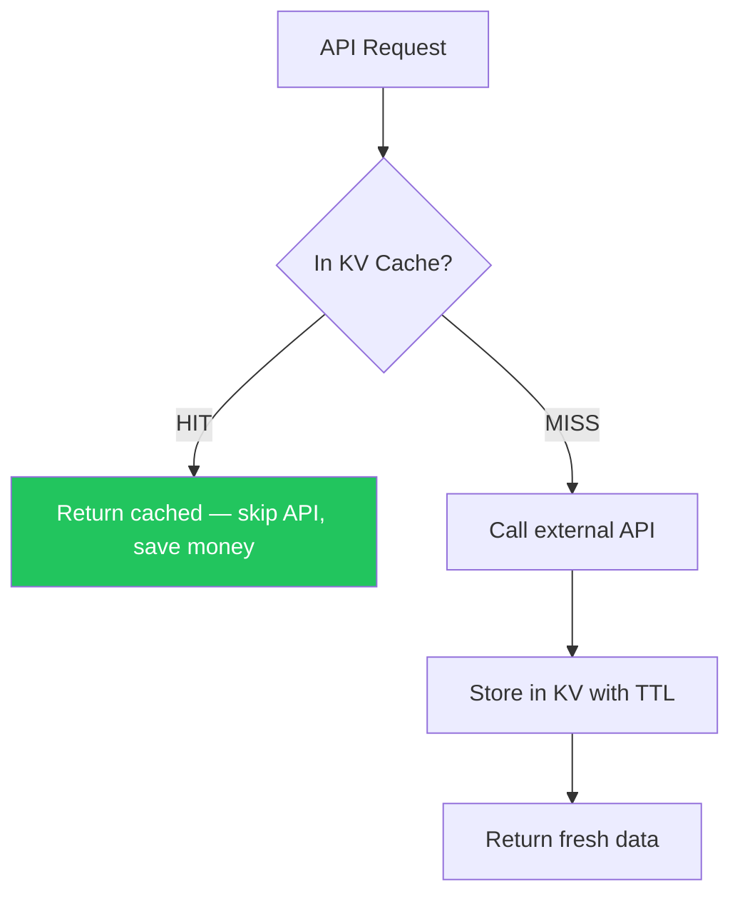
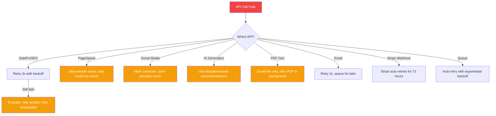

# AuditMyBusiness.com — Technical Architecture

Detailed breakdown of how data flows, which APIs are called, what gets stored, and how the report is generated.

---

## 1. High-Level Architecture



---

## 2. Database Schema (Cloudflare D1)

### `orders` table
```sql
CREATE TABLE orders (
  id TEXT PRIMARY KEY,              -- uuid
  email TEXT NOT NULL,
  business_name TEXT NOT NULL,
  business_address TEXT,
  place_id TEXT,                    -- Google Places ID (if found)
  country TEXT,                     -- US, UK, DE, etc.
  language TEXT DEFAULT 'en',
  amount_cents INTEGER NOT NULL,    -- 1900 = $19.00
  currency TEXT DEFAULT 'usd',
  stripe_session_id TEXT,
  stripe_payment_intent TEXT,
  status TEXT DEFAULT 'pending',    -- pending, paid, generating, completed, failed, refunded
  report_id TEXT,                   -- FK to reports.id
  created_at TEXT DEFAULT (datetime('now')),
  updated_at TEXT DEFAULT (datetime('now'))
);
```

### `reports` table
```sql
CREATE TABLE reports (
  id TEXT PRIMARY KEY,              -- uuid (also used in URL: /report/{id})
  order_id TEXT NOT NULL,
  business_name TEXT NOT NULL,
  business_address TEXT,
  place_id TEXT,

  -- Overall
  overall_score INTEGER,            -- 0-100
  overall_grade TEXT,               -- A, B, C, D, F

  -- Section scores
  search_score INTEGER,
  maps_score INTEGER,
  reviews_score INTEGER,
  website_score INTEGER,
  social_score INTEGER,

  -- Raw data (JSON blobs)
  search_data TEXT,                 -- JSON: keyword rankings
  maps_data TEXT,                   -- JSON: GMB profile data
  reviews_data TEXT,                -- JSON: reviews + competitors
  website_data TEXT,                -- JSON: PageSpeed results
  social_data TEXT,                 -- JSON: social media presence
  directories_data TEXT,            -- JSON: directory listings
  competitors_data TEXT,            -- JSON: competitor comparison

  -- AI-generated
  action_items TEXT,                -- JSON: array of prioritized actions
  summary TEXT,                     -- AI-generated executive summary

  -- Files
  pdf_key TEXT,                     -- R2 object key for PDF
  pdf_url TEXT,                     -- Presigned URL or public URL

  -- Meta
  status TEXT DEFAULT 'generating', -- generating, completed, failed
  created_at TEXT DEFAULT (datetime('now')),
  completed_at TEXT
);
```

---

## 3. Complete Data Flow

### Step 1: Business Search



### Step 2: Payment



### Step 3: Payment Confirmation & Job Queue



### Step 4: Report Generation (Queue Consumer)

This is the core — the Queue consumer Worker that calls all APIs and builds the report.



### API Details

**SERP Rankings (DataForSEO)**
- Endpoint: `/v3/serp/google/organic/live/advanced`
- 5 queries per report: brand search, category+city, category+neighborhood, "best"+category+city, brand name only
- Returns: rank position, page number, found or not
- Cost: ~$0.01

**Maps/GMB Profile (DataForSEO)**
- Endpoint: `/v3/business_data/google/my_business_info/`
- Returns: name, address, phone, hours, categories, description, photos_count, rating, reviews_count, website, attributes
- Cost: ~$0.01

**Reviews + Competitors (DataForSEO)**
- Endpoint: `/v3/serp/google/maps/live/advanced`
- Query: "{category} near {address}"
- Returns: your business + top 5 nearby competitors with ratings/reviews
- Cost: ~$0.002

**Website Check (Google PageSpeed)**
- Endpoint: PageSpeed Insights API
- Returns: performance score, FCP, LCP, CLS, mobile score, opportunities
- Also: SSL check (direct HTTPS fetch), redirects, meta tags
- Cost: FREE

**Social Media (Direct checks)**
- Fetch facebook.com/{name_slug} and instagram.com/{handle}
- Derive handles from GMB website or business name
- Cost: FREE

**AI Insights (Workers AI or Claude)**
- Input: all scan data + scores
- Output: executive summary + 5 prioritized action items
- Each action: title, why it matters, how to fix, priority, estimated impact
- Cost: ~$0.02

### Step 5: User Views Report



---

## 4. Scoring Algorithm Detail

### Search Score (0-100)

```
Inputs:
  - brand_search_rank (searching business name)
  - category_searches[] (5 keyword rankings)

Calculation:
  brand_points = 0
  if brand on page 1, position 1-3: 40 points
  if brand on page 1, position 4-10: 30 points
  if brand on page 2: 15 points
  if not found: 0 points

  category_points = 0
  for each keyword (5 keywords, 12 points each = 60 max):
    if page 1, position 1-3: 12 points
    if page 1, position 4-10: 8 points
    if page 2: 4 points
    if page 3: 2 points
    if not found: 0 points

  search_score = brand_points + category_points
```

### Maps Score (0-100)

```
Inputs: GMB profile data

Calculation:
  listed = 15 points (yes/no)
  verified = 10 points
  hours_listed = 10 points
  phone_listed = 5 points
  address_correct = 5 points
  description_filled = 10 points (min 100 chars)
  categories_set = 5 points
  photos >= 25: 15 points
  photos >= 10: 10 points
  photos >= 5: 5 points
  photos < 5: 0 points
  has_posts = 5 points (posted in last 30 days)
  has_qa = 5 points
  menu_listed = 5 points
  website_linked = 5 points
  attributes_filled = 5 points

  maps_score = sum of applicable points (cap at 100)
```

### Reviews Score (0-100)

```
Inputs:
  - review_count
  - avg_rating
  - response_rate (% of reviews owner replied to)
  - competitor_avg_reviews
  - competitor_avg_rating

Calculation:
  count_points = 0
  if review_count >= 200: 30 points
  if review_count >= 100: 25 points
  if review_count >= 50: 20 points
  if review_count >= 20: 15 points
  if review_count >= 10: 10 points
  if review_count >= 5: 5 points
  if review_count < 5: 0 points

  rating_points = 0
  if avg_rating >= 4.5: 25 points
  if avg_rating >= 4.0: 20 points
  if avg_rating >= 3.5: 15 points
  if avg_rating >= 3.0: 10 points
  if avg_rating < 3.0: 0 points

  response_points = response_rate * 0.2 (max 20 points)

  competitive_points = 0
  your_reviews_vs_avg = review_count / competitor_avg_reviews
  if ratio >= 1.0: 25 points (you match or beat competitors)
  if ratio >= 0.5: 15 points
  if ratio >= 0.2: 10 points
  if ratio < 0.2: 0 points

  reviews_score = count + rating + response + competitive
```

### Website Score (0-100)

```
Inputs: PageSpeed data + manual checks

Calculation:
  exists = 25 points (yes/no — if no website, score is 0)
  performance_score = pagespeed_score * 0.25 (max 25 points)
  mobile_friendly = 20 points (yes/no from PageSpeed)
  ssl_valid = 15 points (HTTPS works, cert valid)
  has_meta_title = 5 points
  has_meta_description = 5 points
  loads_under_3s = 5 points

  website_score = sum (or 0 if no website exists)
```

### Social Score (0-100)

```
Inputs: Social media checks

Calculation:
  facebook_exists = 20 points
  facebook_active = 15 points (posted in last 30 days)
  instagram_exists = 20 points
  instagram_active = 15 points (posted in last 30 days)
  has_any_followers = 10 points (>100 on any platform)
  consistent_branding = 10 points (same name/logo across platforms)
  additional_platforms = 10 points (YouTube, LinkedIn, TikTok)

  social_score = sum (cap at 100)
```

### Overall Score

```
overall_score = (
  search_score  × 0.25 +
  maps_score    × 0.25 +
  reviews_score × 0.25 +
  website_score × 0.15 +
  social_score  × 0.10
)

Grade:
  90-100 = A  (Excellent — top 10% of local businesses)
  80-89  = B  (Good — minor improvements needed)
  60-79  = C  (Needs Work — several gaps)
  40-59  = D  (Poor — significant issues)
  0-39   = F  (Critical — almost no online presence)
```

---

## 5. Keyword Selection Logic

How we pick which keywords to check for each business:

```
Input: business_name, business_category, city, neighborhood

Generate 5 search queries:

1. Brand search:
   "{business_name}"
   Example: "Royal Biryani House"

2. Category + city:
   "{category} {city}"
   Example: "biryani restaurant Hyderabad"

3. Category + neighborhood:
   "{category} near {neighborhood}"
   Example: "biryani near Madhapur"

4. "Best" + category + city:
   "best {category} {city}"
   Example: "best biryani Hyderabad"

5. Category + "near me" (simulated with location):
   "{category} near me"
   (with location_code set to business city)
   Example: "restaurants near me" [location: Hyderabad]

Category is derived from:
  - Google Places types (e.g., "restaurant", "hair_salon")
  - DataForSEO Maps category field
  - Fallback: ask user during manual entry
```

---

## 6. Caching Strategy (Cloudflare KV)



| Data | TTL | KV Key Format |
|------|-----|---------------|
| Places search | 24 hours | `search:{md5(query+location)}` |
| SERP rankings | 7 days | `serp:{md5(keyword+location)}` |
| Maps/GMB data | 7 days | `gmb:{place_id}` |
| PageSpeed | 7 days | `pagespeed:{md5(url)}` |
| Social checks | 24 hours | `social:{md5(platform+handle)}` |
| **Reviews** | **NOT cached** | Count changes frequently |
| **Report data** | **NOT cached** | Served from D1 directly |

**Why cache?** If someone audits "pizza restaurant New York" and then another person audits a different pizza place in the same city, some SERP data overlaps. Caching saves API costs.

---

## 7. Error Handling & Retries



---

## 8. Cloudflare Bindings (wrangler.jsonc)

```jsonc
{
  "name": "auditmybusiness",
  "main": "./dist/_worker.js",
  "compatibility_date": "2026-03-01",

  "d1_databases": [{
    "binding": "DB",
    "database_name": "auditmybusiness-db",
    "database_id": "xxx"
  }],

  "r2_buckets": [{
    "binding": "REPORTS_BUCKET",
    "bucket_name": "auditmybusiness-reports"
  }],

  "kv_namespaces": [{
    "binding": "CACHE",
    "id": "xxx"
  }],

  "queues": {
    "producers": [{
      "binding": "REPORT_QUEUE",
      "queue": "report-generation"
    }],
    "consumers": [{
      "queue": "report-generation",
      "max_retries": 3,
      "max_batch_size": 1,
      "max_batch_timeout": 0
    }]
  },

  "browser": {
    "binding": "BROWSER"
  },

  "ai": {
    "binding": "AI"
  },

  "vars": {
    "STRIPE_PUBLIC_KEY": "pk_live_xxx",
    "SITE_URL": "https://auditmybusiness.com"
  },

  "secrets": [
    "STRIPE_SECRET_KEY",
    "STRIPE_WEBHOOK_SECRET",
    "DATAFORSEO_LOGIN",
    "DATAFORSEO_PASSWORD",
    "GOOGLE_PLACES_API_KEY",
    "RESEND_API_KEY"
  ]
}
```

---

## 9. API Cost Summary Per Report

| API Call | # Calls | Cost |
|----------|---------|------|
| Google Places search | 1 | ~$0.003 |
| DataForSEO SERP | 5 | ~$0.01 |
| DataForSEO Maps | 1 | ~$0.002 |
| DataForSEO Business | 1 | ~$0.01 |
| Google PageSpeed | 1 | FREE |
| SSL check | 1 | FREE |
| Social media checks | 2-3 | FREE |
| Workers AI / Claude | 1 | ~$0.02 |
| Browser Rendering | 1 | FREE |
| Resend email | 1 | FREE |
| **TOTAL PER REPORT** | | **~$0.05** |
| **REVENUE PER REPORT** | | **$19.00** |
| **GROSS MARGIN** | | **99.7%** |

---

## 10. Processing Timeline

```mermaid
gantt
    title Report Generation Timeline — ~15-20s total
    dateFormat ss
    axisFormat %Ss

    section Payment
    Webhook received           :done, 00, 1s
    Queue job                  :done, 01, 1s

    section Scanning - Parallel
    SERP queries x5            :active, 02, 4s
    Maps and GMB data          :active, 02, 3s
    Reviews + competitors      :active, 02, 3s
    PageSpeed                  :active, 02, 4s
    Social media checks        :active, 02, 2s

    section Processing
    Calculate scores           :06, 1s
    AI insights                :07, 3s
    Store in D1                :10, 1s

    section Delivery
    Generate PDF               :11, 3s
    Upload to R2               :14, 1s
    Send email                 :15, 1s
```


