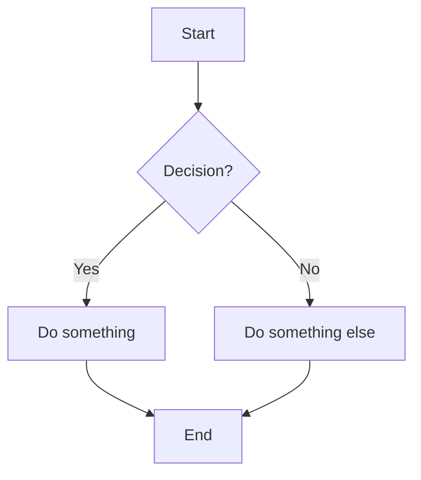
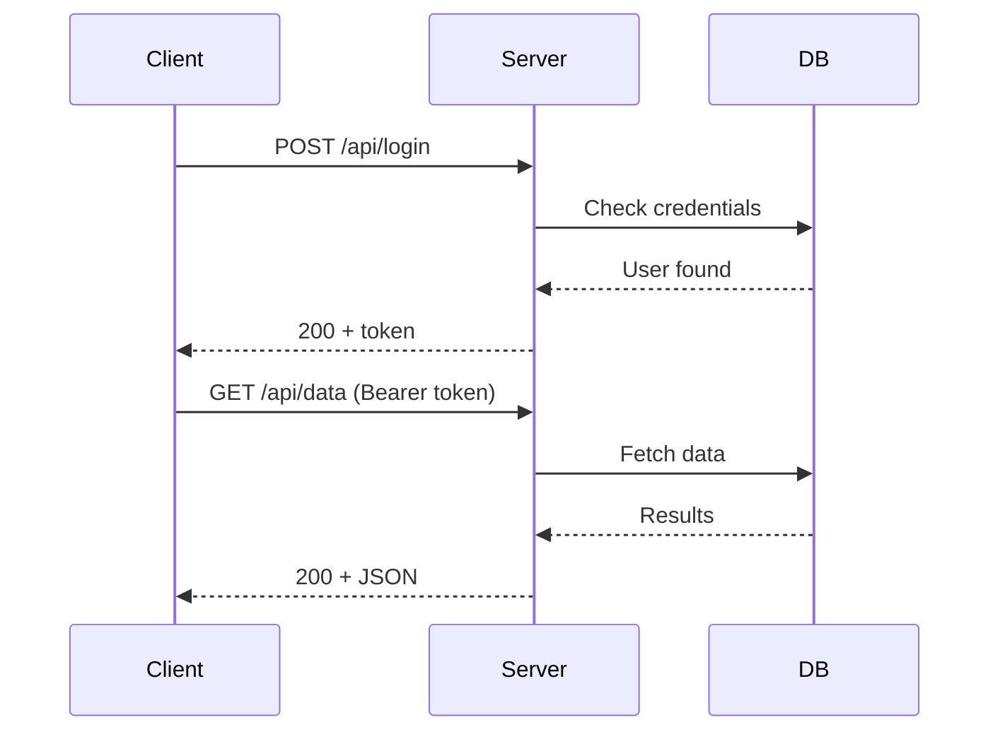
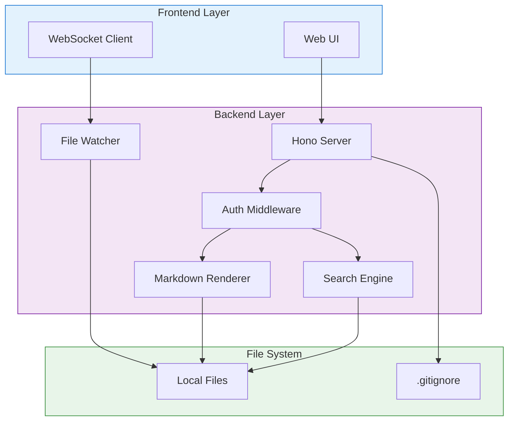
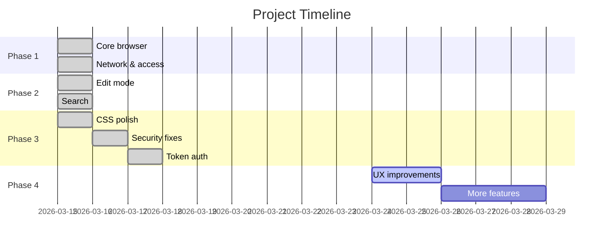
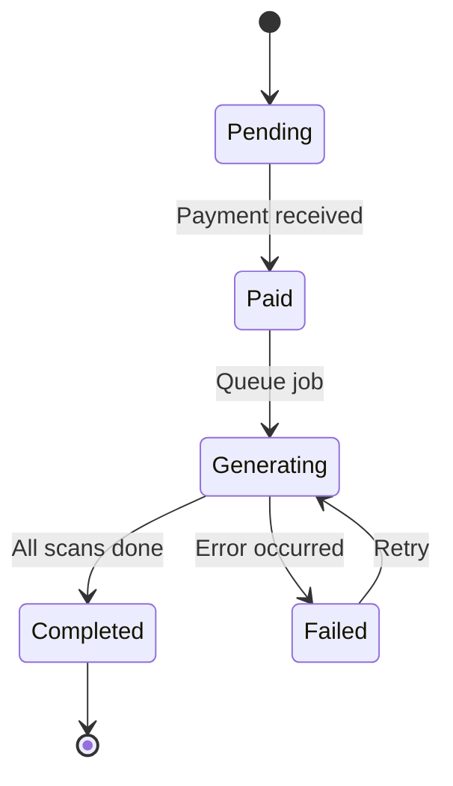

# Mermaid Diagram Examples

## Flowchart

```mermaid
graph TD
    A[Start] --> B{Decision?}
    B -->|Yes| C[Do something]
    B -->|No| D[Do something else]
    C --> E[End]
    D --> E
```

## Sequence Diagram

```mermaid
sequenceDiagram
    participant Client
    participant Server
    participant DB

    Client->>Server: POST /api/login
    Server->>DB: Check credentials
    DB-->>Server: User found
    Server-->>Client: 200 + token
    Client->>Server: GET /api/data (Bearer token)
    Server->>DB: Fetch data
    DB-->>Server: Results
    Server-->>Client: 200 + JSON
```

## Complex Architecture

```mermaid
graph TB
    subgraph Frontend["Frontend Layer"]
        UI[Web UI]
        WS[WebSocket Client]
    end

    subgraph Backend["Backend Layer"]
        API[Hono Server]
        AUTH[Auth Middleware]
        RENDER[Markdown Renderer]
        SEARCH[Search Engine]
        WATCH[File Watcher]
    end

    subgraph Storage["File System"]
        FS[Local Files]
        GIT[.gitignore]
    end

    UI --> API
    WS --> WATCH
    API --> AUTH
    AUTH --> RENDER
    AUTH --> SEARCH
    WATCH --> FS
    RENDER --> FS
    SEARCH --> FS
    API --> GIT

    style Frontend fill:#e3f2fd,stroke:#1976D2
    style Backend fill:#f3e5f5,stroke:#7B1FA2
    style Storage fill:#e8f5e9,stroke:#388E3C
```

## Gantt Chart

```mermaid
gantt
    title Project Timeline
    dateFormat YYYY-MM-DD
    section Phase 1
        Core browser     :done, 2026-03-15, 1d
        Network & access :done, 2026-03-15, 1d
    section Phase 2
        Edit mode        :done, 2026-03-15, 1d
        Search           :done, 2026-03-15, 1d
    section Phase 3
        CSS polish       :done, 2026-03-15, 1d
        Security fixes   :done, 2026-03-16, 1d
        Token auth       :done, 2026-03-17, 1d
    section Phase 4
        UX improvements  :active, 2026-03-24, 2d
        More features    :2026-03-26, 3d
```

## State Diagram

```mermaid
stateDiagram-v2
    [*] --> Pending
    Pending --> Paid: Payment received
    Paid --> Generating: Queue job
    Generating --> Completed: All scans done
    Generating --> Failed: Error occurred
    Failed --> Generating: Retry
    Completed --> [*]
```
